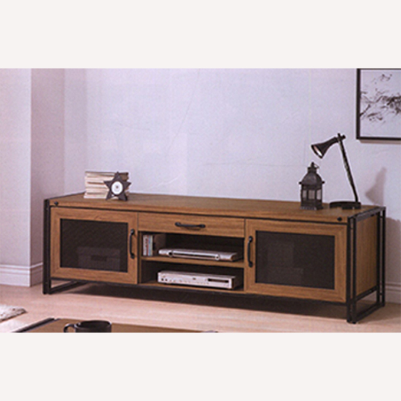
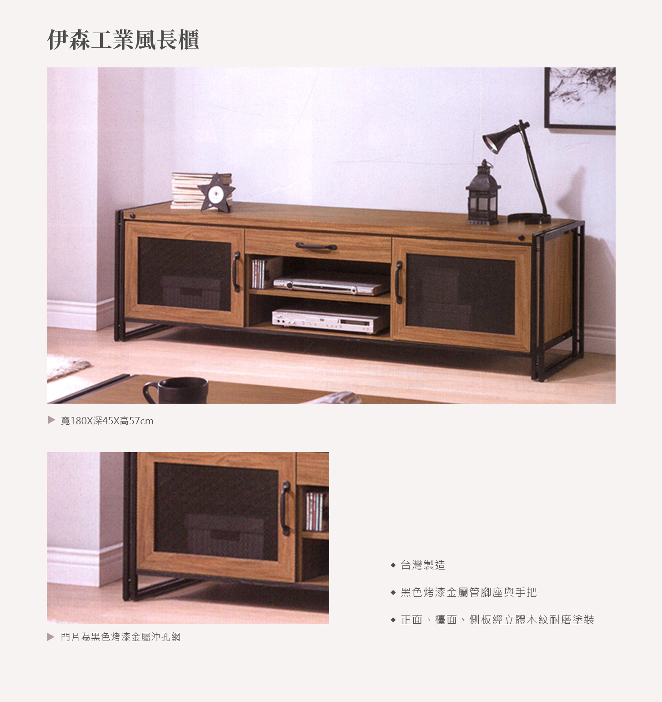
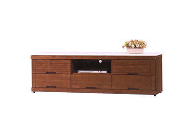
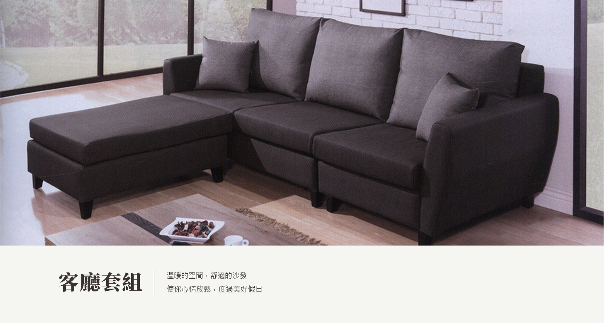

# 1410921036<!DOCTYPE html>
<html lang="en">

<head>
    <meta charset="UTF-8">
    <meta name="description" content="">
    <meta http-equiv="X-UA-Compatible" content="IE=edge">
    <meta name="viewport" content="width=device-width, initial-scale=1, shrink-to-fit=no">

    <!-- Title -->
    <title>伊森工業風長櫃</title>

    <!-- Favicon -->
    <link rel="icon">
    <!-- Stylesheet -->
    <!-- <link href="js/bootstrap/bootstrap-4.3.1.css" rel="stylesheet" type="text/css"> -->
    <link href="css/bootstrap-4.4.1.css" rel="stylesheet" type="text/css">
    <link rel="stylesheet" href="css/style.css">
</head>

<body>
    <!-- Preloader -->
    

        

    

    <!-- /Preloader --><!-- #BeginLibraryItem "/Library/header.lbi" -->    <!-- 表頭區 -->
    <header class="header-area">
      <!-- Search Form -->
      <!-- Main Header Start -->
      

        

          

            <!-- Classy Menu -->
            <nav class="classy-navbar justify-content-between" id="robertoNav" style="height: 64px;">
              <!-- Logo -->
              <a class="nav-brand" href="index.html">頂好傢俱</a>
              <!-- Navbar Toggler -->
              
 

              <!-- Menu -->
              

                <!-- Menu Close Button -->
                

                  

                

                <!-- Nav Start -->
                

                  <ul id="nav">
                    <li class="active"><a href="index.html">首頁</a></li>
                    <li><a href="livivngroom_prolist.html">客廳</a>
                      <ul class="dropdown">
                        <li><a href="sofa.html">沙發</a></li>
                        <li><a href="coffee_table.html">茶几</a></li>
                        <li><a href="#">鞋櫃</a></li>
                        <li><a href="cabinet.html">電視櫃</a></li>
                      </ul>
                    </li>
                    <li><a href="#">臥室</a>
                      <ul class="dropdown">
                        <li><a href="#">化妝台</a></li>
                        <li><a href="#">衣櫃</a></li>
                        <li><a href="#">床組</a></li>
                      </ul>
                    </li>
                    <li><a href="#">廚房</a>
                      <ul class="dropdown">
                        <li><a href="#">餐桌/椅</a></li>
                        <li><a href="#">餐櫃</a></li>
                      </ul>
                    </li>
                    <li><a href="#">書房</a>
                      <ul class="dropdown">
                        <li><a href="#">書櫃/架</a></li>
                        <li><a href="#">書桌</a></li>
                      </ul>
                    </li>
                    <li class="active"><a href="question.html">常見問題</a></li>
                  </ul>
                  <!-- Search -->
                  <!-- Book Now -->
                

                <!-- Nav End -->
              

            </nav>
          

        

      

		<header class="class-1 class-2 my-header"></header>
		<header class="my-header"></header>
    </header>
    <!-- 表頭區 End --><!-- #EndLibraryItem --><!-- 廣告區 Start -->

	

		
        

	
	    
伊森工業風長櫃
			

			
商品編號 A345-05(7331-02)

	  
		
				
	         

					
				   
材質 環保木心板

				   
尺寸 寬180x深45x高57cm

				   
規格

				   

	         

		
	         
	         

	
		
	

		
		

		   
商品介紹

	       

			

	

	
	

   

	   

	   
相似商品

		   

	   
   

		 
  
		   

		   
凱西柚木色石面長櫃

			 

			 
		 
  
		   

		   
凱西柚木色白石長櫃

			 

			 
		  
  
		   

		   
依娜柚木色長櫃

			 	 

	
	  

	

	

	
	
	
    <!-- 廣告區 End -->
	

<!-- #BeginLibraryItem "/Library/footer.lbi" -->
    <!-- 頁腳開始 -->
    <footer class="footer">
      

        
頂好傢俱

        

        
 品味、潮流、風格、實在 為您打造一個舒適的家 
          連絡電話:04-2665-5258 
          地址:台中市梧棲區中華路二段465號 
          營業時間:9:00~21:00 

      

      

        
商品分類

        

        

          
客廳 臥室 廚房 書房

          
沙發 床組 餐櫃 書桌

          

            
茶几 衣櫃 餐桌/椅

            
 書櫃/書架

          

          
鞋櫃 梳妝台

          
電視櫃

        

      

      

        
購物須知

        

        
 所有家具皆以現場為主，並不提供網購服務。 
          一律付現，不接受其他付款方式。 
          傢俱保固期限固定2年。 
        

      

    </footer>
<!-- #EndLibraryItem --><!-- bootstrap 模組用 -->
<!--  -->

<!--  -->

<!-- jQuery 2.2.4 -->

<!-- 大廣告BANNER+MOBILE選單語法 -->

<!-- loading語法 -->

<!-- slick輪播圖 -->    
<link rel="stylesheet" type="text/css" href="js/slick/slick.css">
<link rel="stylesheet" type="text/css" href="js/slick/slick-theme.css">

<!-- slick輪播圖 end -->  
	

  
    
		</body>

</html>
<!DOCTYPE html>
<html lang="en">

<head>
    <meta charset="UTF-8">
    <meta name="description" content="">
    <meta http-equiv="X-UA-Compatible" content="IE=edge">
    <meta name="viewport" content="width=device-width, initial-scale=1, shrink-to-fit=no">

    <!-- Title -->
    <title>科隆升降茶几</title>

    <!-- Favicon -->
    <link rel="icon">
    <!-- Stylesheet -->
    <!-- <link href="js/bootstrap/bootstrap-4.3.1.css" rel="stylesheet" type="text/css"> -->
    <link href="css/bootstrap-4.4.1.css" rel="stylesheet" type="text/css">
    <link rel="stylesheet" href="css/style.css">
</head>

<body>
    <!-- Preloader -->
    

        

    

    <!-- /Preloader --><!-- #BeginLibraryItem "/Library/header.lbi" -->    <!-- 表頭區 -->
    <header class="header-area">
      <!-- Search Form -->
      <!-- Main Header Start -->
      

        

          

            <!-- Classy Menu -->
            <nav class="classy-navbar justify-content-between" id="robertoNav" style="height: 64px;">
              <!-- Logo -->
              <a class="nav-brand" href="index.html">頂好傢俱</a>
              <!-- Navbar Toggler -->
              
 

              <!-- Menu -->
              

                <!-- Menu Close Button -->
                

                  

                

                <!-- Nav Start -->
                

                  <ul id="nav">
                    <li class="active"><a href="index.html">首頁</a></li>
                    <li><a href="livivngroom_prolist.html">客廳</a>
                      <ul class="dropdown">
                        <li><a href="sofa.html">沙發</a></li>
                        <li><a href="coffee_table.html">茶几</a></li>
                        <li><a href="#">鞋櫃</a></li>
                        <li><a href="cabinet.html">電視櫃</a></li>
                      </ul>
                    </li>
                    <li><a href="#">臥室</a>
                      <ul class="dropdown">
                        <li><a href="#">化妝台</a></li>
                        <li><a href="#">衣櫃</a></li>
                        <li><a href="#">床組</a></li>
                      </ul>
                    </li>
                    <li><a href="#">廚房</a>
                      <ul class="dropdown">
                        <li><a href="#">餐桌/椅</a></li>
                        <li><a href="#">餐櫃</a></li>
                      </ul>
                    </li>
                    <li><a href="#">書房</a>
                      <ul class="dropdown">
                        <li><a href="#">書櫃/架</a></li>
                        <li><a href="#">書桌</a></li>
                      </ul>
                    </li>
                    <li class="active"><a href="question.html">常見問題</a></li>
                  </ul>
                  <!-- Search -->
                  <!-- Book Now -->
                

                <!-- Nav End -->
              

            </nav>
          

        

      

		<header class="class-1 class-2 my-header"></header>
		<header class="my-header"></header>
    </header>
    <!-- 表頭區 End --><!-- #EndLibraryItem --><!-- 廣告區 Start -->

	

		
        

	
	    
科隆升降茶几
			

			
商品編號 A257-01(19295-03)

	  
		
				
	         

					
				   
材質 環保木心板

				   
尺寸 寬110x深70x高47cm(升降高度61cm)

				   
規格

				   

	         

		
	         
	         

	
		
	

		
		

		   
商品介紹

	       

			

	

	
	

   

	   

	   
相似商品

		   

	   
   

		 
  
		   

		   
布爾升降茶几

			 

			 
		 
  
		   

		   
布爾石面茶几

			 

			 
		  
  
		   

		   
文森石面斜角大茶几

			 	 

	
	  

	

	

	
	
	
    <!-- 廣告區 End -->
	

<!-- #BeginLibraryItem "/Library/footer.lbi" -->
    <!-- 頁腳開始 -->
    <footer class="footer">
      

        
頂好傢俱

        

        
 品味、潮流、風格、實在 為您打造一個舒適的家 
          連絡電話:04-2665-5258 
          地址:台中市梧棲區中華路二段465號 
          營業時間:9:00~21:00 

      

      

        
商品分類

        

        

          
客廳 臥室 廚房 書房

          
沙發 床組 餐櫃 書桌

          

            
茶几 衣櫃 餐桌/椅

            
 書櫃/書架

          

          
鞋櫃 梳妝台

          
電視櫃

        

      

      

        
購物須知

        

        
 所有家具皆以現場為主，並不提供網購服務。 
          一律付現，不接受其他付款方式。 
          傢俱保固期限固定2年。 
        

      

    </footer>
<!-- #EndLibraryItem --><!-- bootstrap 模組用 -->
<!--  -->

<!--  -->

<!-- jQuery 2.2.4 -->

<!-- 大廣告BANNER+MOBILE選單語法 -->

<!-- loading語法 -->

<!-- slick輪播圖 -->    
<link rel="stylesheet" type="text/css" href="js/slick/slick.css">
<link rel="stylesheet" type="text/css" href="js/slick/slick-theme.css">

<!-- slick輪播圖 end -->  
	

  
    
		</body>

</html>
<!DOCTYPE html>
<html lang="en">

<head>
    <meta charset="UTF-8">
    <meta name="description" content="">
    <meta http-equiv="X-UA-Compatible" content="IE=edge">
    <meta name="viewport" content="width=device-width, initial-scale=1, shrink-to-fit=no">

    <!-- Title -->
    <title>頂好傢俱</title>

    <!-- Favicon -->
    <link rel="icon">
    <!-- Stylesheet -->
    <!-- <link href="js/bootstrap/bootstrap-4.3.1.css" rel="stylesheet" type="text/css"> -->
    <link href="css/bootstrap-4.4.1.css" rel="stylesheet" type="text/css">
    <link rel="stylesheet" href="css/style.css">
</head>

<body>
    <!-- Preloader -->
    

        

    

    <!-- /Preloader --><!-- #BeginLibraryItem "/Library/header.lbi" -->    <!-- 表頭區 -->
    <header class="header-area">
      <!-- Search Form -->
      <!-- Main Header Start -->
      

        

          

            <!-- Classy Menu -->
            <nav class="classy-navbar justify-content-between" id="robertoNav" style="height: 64px;">
              <!-- Logo -->
              <a class="nav-brand" href="index.html">頂好傢俱</a>
              <!-- Navbar Toggler -->
              
 

              <!-- Menu -->
              

                <!-- Menu Close Button -->
                

                  

                

                <!-- Nav Start -->
                

                  <ul id="nav">
                    <li class="active"><a href="index.html">首頁</a></li>
                    <li><a href="livivngroom_prolist.html">客廳</a>
                      <ul class="dropdown">
                        <li><a href="sofa.html">沙發</a></li>
                        <li><a href="coffee_table.html">茶几</a></li>
                        <li><a href="#">鞋櫃</a></li>
                        <li><a href="cabinet.html">電視櫃</a></li>
                      </ul>
                    </li>
                    <li><a href="#">臥室</a>
                      <ul class="dropdown">
                        <li><a href="#">化妝台</a></li>
                        <li><a href="#">衣櫃</a></li>
                        <li><a href="#">床組</a></li>
                      </ul>
                    </li>
                    <li><a href="#">廚房</a>
                      <ul class="dropdown">
                        <li><a href="#">餐桌/椅</a></li>
                        <li><a href="#">餐櫃</a></li>
                      </ul>
                    </li>
                    <li><a href="#">書房</a>
                      <ul class="dropdown">
                        <li><a href="#">書櫃/架</a></li>
                        <li><a href="#">書桌</a></li>
                      </ul>
                    </li>
                    <li class="active"><a href="question.html">常見問題</a></li>
                  </ul>
                  <!-- Search -->
                  <!-- Book Now -->
                

                <!-- Nav End -->
              

            </nav>
          

        

      

		<header class="class-1 class-2 my-header"></header>
		<header class="my-header"></header>
    </header>
    <!-- 表頭區 End --><!-- #EndLibraryItem --><!-- 廣告區 Start -->
	

	  <ol class="carousel-indicators">
        <li data-target="#carouselExampleIndicators1" data-slide-to="0" class="active"></li>
        <li data-target="#carouselExampleIndicators1" data-slide-to="1"></li>
        <li data-target="#carouselExampleIndicators1" data-slide-to="2"></li>
      </ol>
		
      

        
 
          

        

		  
        
 
          

        

		  
        
 
          

        

      

		
      <a class="carousel-control-prev" href="#carouselExampleIndicators1" role="button" data-slide="prev">  Previous </a> <a class="carousel-control-next" href="#carouselExampleIndicators1" role="button" data-slide="next">  Next </a> 

    <!-- 廣告區 End -->
	
<main class="main">
      <section class="section">
		

		  

			  <a href="livivngroom_prolist.html">
				  

					
客廳
						
Living Room

						

				  

				
沙發 茶几 鞋櫃 電視櫃

			</a>
		  

			

				<a href="#">
			       

	                
臥室
	                    
Bedroom

					    

				    

			      
床組 衣櫃 梳妝台

				</a>
			

			

				<a href="#">
			       

	               
廚房
					   
Kitchen

					   

				   

			     
餐櫃 餐桌/椅

				</a>
			

			

				<a href="#">
			      

	              
書房
					  
Study

					  

				  

			     
書桌 書櫃/架

				</a>
			

	    

      </section>
	
</main>
	

		  

			  <a href="#">
			    
			    
more▶

			  </a>
		  

		  

			  <a href="#">
			    
		        
more▶

			  </a>	  
          

	

<!-- #BeginLibraryItem "/Library/footer.lbi" -->
    <!-- 頁腳開始 -->
    <footer class="footer">
      

        
頂好傢俱

        

        
 品味、潮流、風格、實在 為您打造一個舒適的家 
          連絡電話:04-2665-5258 
          地址:台中市梧棲區中華路二段465號 
          營業時間:9:00~21:00 

      

      

        
商品分類

        

        

          
客廳 臥室 廚房 書房

          
沙發 床組 餐櫃 書桌

          

            
茶几 衣櫃 餐桌/椅

            
 書櫃/書架

          

          
鞋櫃 梳妝台

          
電視櫃

        

      

      

        
購物須知

        

        
 所有家具皆以現場為主，並不提供網購服務。 
          一律付現，不接受其他付款方式。 
          傢俱保固期限固定2年。 
        

      

    </footer>
<!-- #EndLibraryItem --><!-- bootstrap 模組用 -->
<!--  -->

<!--  -->

<!-- jQuery 2.2.4 -->

<!-- 大廣告BANNER+MOBILE選單語法 -->

<!-- loading語法 -->

<!-- slick輪播圖 -->    
<link rel="stylesheet" type="text/css" href="js/slick/slick.css">
<link rel="stylesheet" type="text/css" href="js/slick/slick-theme.css">

<!-- slick輪播圖 end -->  
	

  
    
</body>

</html>
<!DOCTYPE html>
<html lang="en">

<head>
    <meta charset="UTF-8">
    <meta name="description" content="">
    <meta http-equiv="X-UA-Compatible" content="IE=edge">
    <meta name="viewport" content="width=device-width, initial-scale=1, shrink-to-fit=no">

    <!-- Title -->
    <title>客廳</title>

    <!-- Favicon -->
    <link rel="icon">
    <!-- Stylesheet -->
    <!-- <link href="js/bootstrap/bootstrap-4.3.1.css" rel="stylesheet" type="text/css"> -->
    <link href="css/bootstrap-4.4.1.css" rel="stylesheet" type="text/css">
    <link rel="stylesheet" href="css/style.css">
</head>

<body>
    <!-- Preloader -->
    

        

    

    <!-- /Preloader --><!-- #BeginLibraryItem "/Library/header.lbi" -->    <!-- 表頭區 -->
    <header class="header-area">
      <!-- Search Form -->
      <!-- Main Header Start -->
      

        

          

            <!-- Classy Menu -->
            <nav class="classy-navbar justify-content-between" id="robertoNav" style="height: 64px;">
              <!-- Logo -->
              <a class="nav-brand" href="index.html">頂好傢俱</a>
              <!-- Navbar Toggler -->
              
 

              <!-- Menu -->
              

                <!-- Menu Close Button -->
                

                  

                

                <!-- Nav Start -->
                

                  <ul id="nav">
                    <li class="active"><a href="index.html">首頁</a></li>
                    <li><a href="livivngroom_prolist.html">客廳</a>
                      <ul class="dropdown">
                        <li><a href="sofa.html">沙發</a></li>
                        <li><a href="coffee_table.html">茶几</a></li>
                        <li><a href="#">鞋櫃</a></li>
                        <li><a href="cabinet.html">電視櫃</a></li>
                      </ul>
                    </li>
                    <li><a href="#">臥室</a>
                      <ul class="dropdown">
                        <li><a href="#">化妝台</a></li>
                        <li><a href="#">衣櫃</a></li>
                        <li><a href="#">床組</a></li>
                      </ul>
                    </li>
                    <li><a href="#">廚房</a>
                      <ul class="dropdown">
                        <li><a href="#">餐桌/椅</a></li>
                        <li><a href="#">餐櫃</a></li>
                      </ul>
                    </li>
                    <li><a href="#">書房</a>
                      <ul class="dropdown">
                        <li><a href="#">書櫃/架</a></li>
                        <li><a href="#">書桌</a></li>
                      </ul>
                    </li>
                    <li class="active"><a href="question.html">常見問題</a></li>
                  </ul>
                  <!-- Search -->
                  <!-- Book Now -->
                

                <!-- Nav End -->
              

            </nav>
          

        

      

		<header class="class-1 class-2 my-header"></header>
		<header class="my-header"></header>
    </header>
    <!-- 表頭區 End --><!-- #EndLibraryItem --><!-- 廣告區 Start -->

	

	

		<a herf="#">沙發</a>
	

	

		<a herf="#">茶几</a>
	

	

		<a herf="#">鞋櫃</a>
	

	

		<a herf="#">電視櫃</a>
	

	

	
	
	

	
	
  

	
	

		
	    

			<a herf="#">
			   
		       
布里安L型皮沙發

		    </a>
		

		

			<a href="sofa.html">
			  
		      
帝姆L型皮沙發

			</a>
		

		

			<a herf="#">
			  
		      
丹尼L型米黃皮沙發

			</a>
		

	

	
	
	

		
	    

			<a href="coffee_table.html">
		       
		       
科隆升降大茶几

			</a>
		

		

			<a herf="#">
		       
		       
漢諾威石面大茶几

			</a>
		

		

			<a herf="#">
		      
		      
伯特工業風大茶几

			</a>
		

	

	
	
	
	

		
	    

			<a herf="#">
			  
		      
科隆4尺雙面鞋櫃

			</a>
		

		

			<a herf="#">
			  
		      
里斯本4尺雙面鞋櫃

			</a>
		

		

			<a herf="#">
			  
		      
克萊兒胡桃4尺雙面鞋櫃

			</a>
		

		
	

	
	
	

	
		

			<a href="cabinet.html">
			  
		      
伊森工業風長櫃

			</a>
		

		

			<a herf="#">
			  
		      
依娜柚木色長櫃

			</a>
		

		

			<a herf="#">
			  
		      
凱西柚木色白石長櫃

			</a>
		

		
	

	

	
<!-- 廣告區 End -->
	

		

			<a herf="#">1</a>
		
 
	    

			<a herf="#">2</a>
		

		

			<a herf="#">3</a>
		

	
	
	
	

	
	
	
	
	
	
	
	
	
	

<!-- #BeginLibraryItem "/Library/footer.lbi" -->
    <!-- 頁腳開始 -->
    <footer class="footer">
      

        
頂好傢俱

        

        
 品味、潮流、風格、實在 為您打造一個舒適的家 
          連絡電話:04-2665-5258 
          地址:台中市梧棲區中華路二段465號 
          營業時間:9:00~21:00 

      

      

        
商品分類

        

        

          
客廳 臥室 廚房 書房

          
沙發 床組 餐櫃 書桌

          

            
茶几 衣櫃 餐桌/椅

            
 書櫃/書架

          

          
鞋櫃 梳妝台

          
電視櫃

        

      

      

        
購物須知

        

        
 所有家具皆以現場為主，並不提供網購服務。 
          一律付現，不接受其他付款方式。 
          傢俱保固期限固定2年。 
        

      

    </footer>
<!-- #EndLibraryItem --><!-- bootstrap 模組用 -->
<!--  -->

<!--  -->

<!-- jQuery 2.2.4 -->

<!-- 大廣告BANNER+MOBILE選單語法 -->

<!-- loading語法 -->

<!-- slick輪播圖 -->    
<link rel="stylesheet" type="text/css" href="js/slick/slick.css">
<link rel="stylesheet" type="text/css" href="js/slick/slick-theme.css">

<!-- slick輪播圖 end -->  
	

  
    
		</body>

</html>
<!DOCTYPE html>
<html lang="en">

<head>
    <meta charset="UTF-8">
    <meta name="description" content="">
    <meta http-equiv="X-UA-Compatible" content="IE=edge">
    <meta name="viewport" content="width=device-width, initial-scale=1, shrink-to-fit=no">

    <!-- Title -->
    <title>常見問題</title>

    <!-- Favicon -->
    <link rel="icon">
    <!-- Stylesheet -->
    <!-- <link href="js/bootstrap/bootstrap-4.3.1.css" rel="stylesheet" type="text/css"> -->
    <link href="css/bootstrap-4.4.1.css" rel="stylesheet" type="text/css">
    <link rel="stylesheet" href="css/style.css">
</head>

<body>
    <!-- Preloader -->
    

        

    

    <!-- /Preloader --><!-- #BeginLibraryItem "/Library/header.lbi" -->    <!-- 表頭區 -->
    <header class="header-area">
      <!-- Search Form -->
      <!-- Main Header Start -->
      

        

          

            <!-- Classy Menu -->
            <nav class="classy-navbar justify-content-between" id="robertoNav" style="height: 64px;">
              <!-- Logo -->
              <a class="nav-brand" href="index.html">頂好傢俱</a>
              <!-- Navbar Toggler -->
              
 

              <!-- Menu -->
              

                <!-- Menu Close Button -->
                

                  

                

                <!-- Nav Start -->
                

                  <ul id="nav">
                    <li class="active"><a href="index.html">首頁</a></li>
                    <li><a href="livivngroom_prolist.html">客廳</a>
                      <ul class="dropdown">
                        <li><a href="sofa.html">沙發</a></li>
                        <li><a href="coffee_table.html">茶几</a></li>
                        <li><a href="#">鞋櫃</a></li>
                        <li><a href="cabinet.html">電視櫃</a></li>
                      </ul>
                    </li>
                    <li><a href="#">臥室</a>
                      <ul class="dropdown">
                        <li><a href="#">化妝台</a></li>
                        <li><a href="#">衣櫃</a></li>
                        <li><a href="#">床組</a></li>
                      </ul>
                    </li>
                    <li><a href="#">廚房</a>
                      <ul class="dropdown">
                        <li><a href="#">餐桌/椅</a></li>
                        <li><a href="#">餐櫃</a></li>
                      </ul>
                    </li>
                    <li><a href="#">書房</a>
                      <ul class="dropdown">
                        <li><a href="#">書櫃/架</a></li>
                        <li><a href="#">書桌</a></li>
                      </ul>
                    </li>
                    <li class="active"><a href="question.html">常見問題</a></li>
                  </ul>
                  <!-- Search -->
                  <!-- Book Now -->
                

                <!-- Nav End -->
              

            </nav>
          

        

      

		<header class="class-1 class-2 my-header"></header>
		<header class="my-header"></header>
    </header>
    <!-- 表頭區 End --><!-- #EndLibraryItem -->
常見問題

	

 
   

	
   

<dl class="modules-collapse">
  
	
    <dt class="active dtstyle">Q:營業時間?</dt>
    <dd class="ddstyle">A:早上9:00~晚上21:00。</dd>

  
	
    <dt class="active dtstyle">Q:付款方式?</dt>
    <dd class="ddstyle">A:一律付現，不接受其他付款方式。</dd>

	
  

    <dt class="active dtstyle">Q:保固期限?</dt>
    <dd class="ddstyle">A:所有家具保固期限皆為2年。</dd>

	
  

    <dt class="active dtstyle">Q:送貨範圍?</dt>
    <dd class="ddstyle">A:台灣縣市皆可，離島運送只幫忙送到漁港，之後的運送部分要自己安排。</dd>

	
  

    <dt class="active dtstyle">Q:關於運費?</dt>
    <dd class="ddstyle">A:台中市免運(已包含在家具費用)，會因樓層高低而不同收費，其他縣市運費另議。</dd>

	
  

    <dt class="active dtstyle">Q:送貨時間?</dt>
    <dd class="ddstyle">A:會依據廠商調貨時間再與客人時間配合。</dd>

	
  

    <dt class="active dtstyle">Q:聯絡方式?</dt>
    <dd class="ddstyle">A:目前只有電話04-2665-5258，沒有社群。</dd>

	
</dl>

	
	
	
	
	
	
	
	
	

<!-- 廣告區 Start -->

    <!-- 頁腳開始 --><!-- #BeginLibraryItem "/Library/footer.lbi" -->    <!-- 頁腳開始 -->
    <footer class="footer">
      

        
頂好傢俱

        

        
 品味、潮流、風格、實在 為您打造一個舒適的家 
          連絡電話:04-2665-5258 
          地址:台中市梧棲區中華路二段465號 
          營業時間:9:00~21:00 

      

      

        
商品分類

        

        

          
客廳 臥室 廚房 書房

          
沙發 床組 餐櫃 書桌

          

            
茶几 衣櫃 餐桌/椅

            
 書櫃/書架

          

          
鞋櫃 梳妝台

          
電視櫃

        

      

      

        
購物須知

        

        
 所有家具皆以現場為主，並不提供網購服務。 
          一律付現，不接受其他付款方式。 
          傢俱保固期限固定2年。 
        

      

    </footer><!-- #EndLibraryItem --><!-- bootstrap 模組用 -->
<!--  -->

<!--  -->

	

<!-- jQuery 2.2.4 -->

<!-- 大廣告BANNER+MOBILE選單語法 -->

<!-- loading語法 -->

<!-- slick輪播圖 -->    
<link rel="stylesheet" type="text/css" href="js/slick/slick.css">
<link rel="stylesheet" type="text/css" href="js/slick/slick-theme.css">

<!-- slick輪播圖 end -->  
	

  
    
		</body>

</html>
# 1410921036
<!DOCTYPE html>
<html lang="en">

<head>
    <meta charset="UTF-8">
    <meta name="description" content="">
    <meta http-equiv="X-UA-Compatible" content="IE=edge">
    <meta name="viewport" content="width=device-width, initial-scale=1, shrink-to-fit=no">

    <!-- Title -->
    <title>帝姆L型皮沙發</title>

    <!-- Favicon -->
    <link rel="icon">
    <!-- Stylesheet -->
    <!-- <link href="js/bootstrap/bootstrap-4.3.1.css" rel="stylesheet" type="text/css"> -->
    <link href="css/bootstrap-4.4.1.css" rel="stylesheet" type="text/css">
    <link rel="stylesheet" href="css/style.css">
</head>

<body>
    <!-- Preloader -->
    

        

    

    <!-- /Preloader --><!-- #BeginLibraryItem "/Library/header.lbi" -->    <!-- 表頭區 -->
    <header class="header-area">
      <!-- Search Form -->
      <!-- Main Header Start -->
      

        

          

            <!-- Classy Menu -->
            <nav class="classy-navbar justify-content-between" id="robertoNav" style="height: 64px;">
              <!-- Logo -->
              <a class="nav-brand" href="index.html">頂好傢俱</a>
              <!-- Navbar Toggler -->
              
 

              <!-- Menu -->
              

                <!-- Menu Close Button -->
                

                  

                

                <!-- Nav Start -->
                

                  <ul id="nav">
                    <li class="active"><a href="index.html">首頁</a></li>
                    <li><a href="livivngroom_prolist.html">客廳</a>
                      <ul class="dropdown">
                        <li><a href="sofa.html">沙發</a></li>
                        <li><a href="coffee_table.html">茶几</a></li>
                        <li><a href="#">鞋櫃</a></li>
                        <li><a href="cabinet.html">電視櫃</a></li>
                      </ul>
                    </li>
                    <li><a href="#">臥室</a>
                      <ul class="dropdown">
                        <li><a href="#">化妝台</a></li>
                        <li><a href="#">衣櫃</a></li>
                        <li><a href="#">床組</a></li>
                      </ul>
                    </li>
                    <li><a href="#">廚房</a>
                      <ul class="dropdown">
                        <li><a href="#">餐桌/椅</a></li>
                        <li><a href="#">餐櫃</a></li>
                      </ul>
                    </li>
                    <li><a href="#">書房</a>
                      <ul class="dropdown">
                        <li><a href="#">書櫃/架</a></li>
                        <li><a href="#">書桌</a></li>
                      </ul>
                    </li>
                    <li class="active"><a href="question.html">常見問題</a></li>
                  </ul>
                  <!-- Search -->
                  <!-- Book Now -->
                

                <!-- Nav End -->
              

            </nav>
          

        

      

		<header class="class-1 class-2 my-header"></header>
		<header class="my-header"></header>
    </header>
    <!-- 表頭區 End --><!-- #EndLibraryItem --><!-- 廣告區 Start -->

	

		
        

	
	    
帝姆L型皮沙發
			

			
商品編號 A229-01(8259-01)

	  
		
				
	         

					
				   
材質 台灣亞麻紋貓抓皮

				   
尺寸 長268x寬160x高45cm(椅背高96cm)

				   
規格

				   

	         

		
	         
	         

	
		
	

		
		

		   
商品介紹

	       

			

	

	
	

   

	   

	   
相似商品

		   

	   
   

		 
  
		   

		   
布里安L型皮沙發

			 

			 
		 
  
		   

		   
比德L型布沙發

			 

			 
		  
  
		   

		   
愛達L型布沙發

			 	 

	
	  

	

	

	
	
	
    <!-- 廣告區 End -->
	

<!-- #BeginLibraryItem "/Library/footer.lbi" -->
    <!-- 頁腳開始 -->
    <footer class="footer">
      

        
頂好傢俱

        

        
 品味、潮流、風格、實在 為您打造一個舒適的家 
          連絡電話:04-2665-5258 
          地址:台中市梧棲區中華路二段465號 
          營業時間:9:00~21:00 

      

      

        
商品分類

        

        

          
客廳 臥室 廚房 書房

          
沙發 床組 餐櫃 書桌

          

            
茶几 衣櫃 餐桌/椅

            
 書櫃/書架

          

          
鞋櫃 梳妝台

          
電視櫃

        

      

      

        
購物須知

        

        
 所有家具皆以現場為主，並不提供網購服務。 
          一律付現，不接受其他付款方式。 
          傢俱保固期限固定2年。 
        

      

    </footer>
<!-- #EndLibraryItem --><!-- bootstrap 模組用 -->
<!--  -->

<!--  -->

<!-- jQuery 2.2.4 -->

<!-- 大廣告BANNER+MOBILE選單語法 -->

<!-- loading語法 -->

<!-- slick輪播圖 -->    
<link rel="stylesheet" type="text/css" href="js/slick/slick.css">
<link rel="stylesheet" type="text/css" href="js/slick/slick-theme.css">

<!-- slick輪播圖 end -->  
	

  
    
		</body>

</html>
